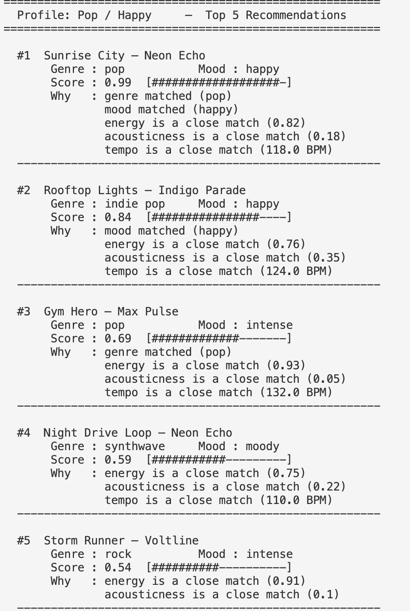
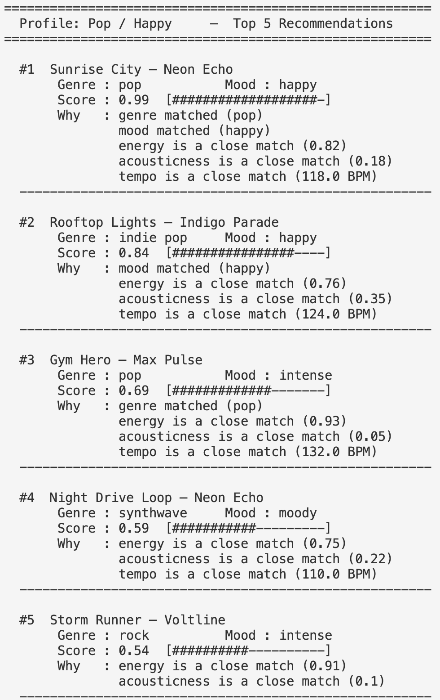

# 🎵 Music Recommender Simulation

## Project Summary

In this project you will build and explain a small music recommender system.

Your goal is to:

- Represent songs and a user "taste profile" as data
- Design a scoring rule that turns that data into recommendations
- Evaluate what your system gets right and wrong
- Reflect on how this mirrors real world AI recommenders

Replace this paragraph with your own summary of what your version does.

---

## How The System Works

Real-world music recommenders like Spotify combine collaborative filtering (analyzing what similar users like) and content-based filtering (matching song attributes to user preferences), often using machine learning for personalization. This simulation prioritizes simplicity and transparency by focusing on content-based filtering with numerical song features, allowing users to see exactly why recommendations are made without complex algorithms or large datasets.

- **Song Features**: Each song uses `energy` (intensity level), `valence` (emotional positivity), `danceability` (groove factor), `acousticness` (acoustic vs. electronic), and `tempo_bpm` (pace, normalized to 0-1).
- **UserProfile Information**: Stores the user's preferred values for the same features (`energy`, `valence`, `danceability`, `acousticness`, `tempo_bpm`), representing their ideal "vibe."
- **Recommender Scoring**: For each song, compute a similarity score per feature using `1 - |user_pref - song_value|`, then average them for an overall score.
- **Recommendation Selection**: Rank songs by score and recommend the top 3-5 matches.

---

### Finalized Algorithm Recipe

For each song in the catalog, `score_song()` computes a weighted similarity score:

**Step 1 — Categorical features** (genre, mood):
- If the song's value matches the user's preference → score `1.0`, otherwise `0.0`

**Step 2 — Numeric features** (energy, acousticness, valence, tempo_bpm, danceability):
- Per-feature similarity = `1 - abs(user_value - song_value)`
- `tempo_bpm` must be normalized first: `tempo_normalized = tempo_bpm / 200`

**Step 3 — Apply weights** and compute the final score:

| Feature | Weight | Reason |
|---|---|---|
| `mood` | 2.0 | Strongest vibe signal — directly reflects how a song feels |
| `energy` | 1.5 | Primary numeric separator between intense and chill tracks |
| `acousticness` | 1.5 | Cleanly divides electric/distorted from organic/mellow sounds |
| `genre` | 1.0 | Useful broad anchor, but one genre can span many moods |
| `tempo_bpm` | 1.0 | Supporting signal for pace |
| `valence` | 1.0 | Supporting signal for emotional brightness |
| `danceability` | 0.5 | Weakest differentiator in this catalog |

```
final_score = Σ(feature_score × weight) / Σ(all weights)
```

`recommend_songs()` collects `(song_dict, score, explanation)` for every song, sorts by score descending, and returns the top `k` results.

---

### Potential Biases

- **Mood can overshadow genre**: Because mood has double the weight of genre, a song with a matching mood but mismatched genre (e.g., a pop/intense track for a rock user) may outscore a rock/chill song. Great genre matches can be buried if the mood is off.
- **Small catalog amplifies gaps**: With only 10 songs, underrepresented genres (ambient, jazz, synthwave each appear once) will almost never rank highly for users who don't prefer them, even if numeric features are a close match.
- **Numeric features assume a single ideal point**: The formula rewards songs closest to the user's target values. A user who enjoys *both* high-energy and chill tracks depending on context cannot be represented — the profile only captures one vibe at a time.
- **tempo_bpm normalization is fragile**: Dividing by 200 works for this dataset (max BPM is 152), but would silently break if songs with BPM > 200 were added without updating the divisor.

---

## Getting Started

### Setup

1. Create a virtual environment (optional but recommended):

   ```bash
   python -m venv .venv
   source .venv/bin/activate      # Mac or Linux
   .venv\Scripts\activate         # Windows

2. Install dependencies

```bash
pip install -r requirements.txt
```

3. Run the app:

```bash
PYTHONPATH=src python3 src/main.py
```

### Sample Output

The terminal displays both taste profiles side by side — song title, artist, genre, mood, a visual score bar, and the specific reasons generated by the scoring function:





### Running Tests

Run the starter tests with:

```bash
pytest
```

You can add more tests in `tests/test_recommender.py`.

---

## Experiments You Tried

Use this section to document the experiments you ran. For example:

- What happened when you changed the weight on genre from 2.0 to 0.5
- What happened when you added tempo or valence to the score
- How did your system behave for different types of users

---

## Limitations and Risks

Summarize some limitations of your recommender.

Examples:

- It only works on a tiny catalog
- It does not understand lyrics or language
- It might over favor one genre or mood

You will go deeper on this in your model card.

---

## Reflection

Read and complete `model_card.md`:

[**Model Card**](model_card.md)

Write 1 to 2 paragraphs here about what you learned:

- about how recommenders turn data into predictions
- about where bias or unfairness could show up in systems like this


---

## 7. `model_card_template.md`

Combines reflection and model card framing from the Module 3 guidance. :contentReference[oaicite:2]{index=2}  

```markdown
# 🎧 Model Card - Music Recommender Simulation

## 1. Model Name

Give your recommender a name, for example:

> VibeFinder 1.0

---

## 2. Intended Use

- What is this system trying to do
- Who is it for

Example:

> This model suggests 3 to 5 songs from a small catalog based on a user's preferred genre, mood, and energy level. It is for classroom exploration only, not for real users.

---

## 3. How It Works (Short Explanation)

Describe your scoring logic in plain language.

- What features of each song does it consider
- What information about the user does it use
- How does it turn those into a number

Try to avoid code in this section, treat it like an explanation to a non programmer.

---

## 4. Data

Describe your dataset.

- How many songs are in `data/songs.csv`
- Did you add or remove any songs
- What kinds of genres or moods are represented
- Whose taste does this data mostly reflect

---

## 5. Strengths

Where does your recommender work well

You can think about:
- Situations where the top results "felt right"
- Particular user profiles it served well
- Simplicity or transparency benefits

---

## 6. Limitations and Bias

Where does your recommender struggle

Some prompts:
- Does it ignore some genres or moods
- Does it treat all users as if they have the same taste shape
- Is it biased toward high energy or one genre by default
- How could this be unfair if used in a real product

---

## 7. Evaluation

How did you check your system

Examples:
- You tried multiple user profiles and wrote down whether the results matched your expectations
- You compared your simulation to what a real app like Spotify or YouTube tends to recommend
- You wrote tests for your scoring logic

You do not need a numeric metric, but if you used one, explain what it measures.

---

## 8. Future Work

If you had more time, how would you improve this recommender

Examples:

- Add support for multiple users and "group vibe" recommendations
- Balance diversity of songs instead of always picking the closest match
- Use more features, like tempo ranges or lyric themes

---

## 9. Personal Reflection

A few sentences about what you learned:

- What surprised you about how your system behaved
- How did building this change how you think about real music recommenders
- Where do you think human judgment still matters, even if the model seems "smart"

