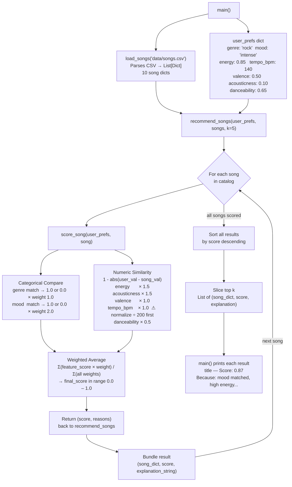

# Music Recommender — Data Flow Diagram

Traces a single song from `songs.csv` through scoring to the final ranked output.

## Key Design Decisions

| Decision | Reason |
|---|---|
| Mood weight = 2.0, Genre weight = 1.0 | Mood is a stronger vibe signal; genre spans multiple moods |
| Energy & acousticness weight = 1.5 | Primary numeric separators between intense rock and chill lofi |
| tempo_bpm normalized ÷ 200 | Raw BPM (60–152) must be on 0–1 scale before `1 - abs(diff)` |
| score_song returns (score, reasons) | Song dict is bundled one level up in recommend_songs, not inside scorer |
| Danceability weight = 0.5 | Weakest differentiator in this 10-song catalog |
